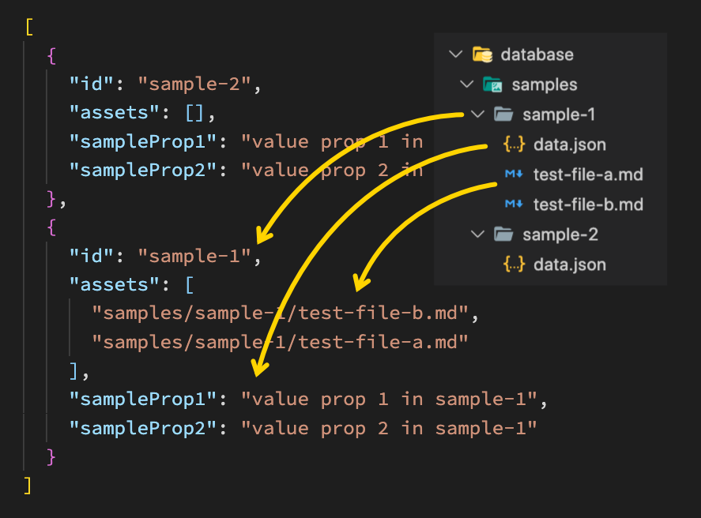

# deno-server-oak-with-filebased-database

Server on **Deno** (Oak) with impromptu file-based database.  
<small>RU: Сервер на **Deno** (используя Oak) с импровизированной файловой базой данных.</small>

## How it works?



## Using

Please, see `samples` in database folder.  
<small>RU: Пожалуйста, посмотрите образцы в папке `database/samples`.</small>

### Running

```bash
deno run --allow-env --allow-net --allow-read --allow-write --unstable server.ts
```

Will be built database cache (see `samples_bundle.json`).  
<small>RU: Будет построен кэш базы данных (см. `samples_bundle.json`).</small>

### Get sample

GET `/api/samples` 

### Update sample

PATCH `/api/samples/:id`

If you send a PATCH-request `/api/samples/sample-1` with body json:  
<small>RU: Если отправить PATCH-запрос на `/api/samples/sample-1` c json:</small>

```json
{
  "sampleProp3": "value prop 3 in sample-1"
}
```

Then this will be added to `database/sample-1/data.json`  
<small>RU: Это будет добавлено в `database/sample-1/data.json`</small>

If you send json:  
<small>RU: Если отправить json:</small>

```json
{
  "sampleProp1": "updated prop 1 in sample-1"
}
```

Property `sampleProp1` is already there, so the property will update.  
<small>RU: Свойсво `sampleProp1` уже есть, оно будет обновлено.</small>
